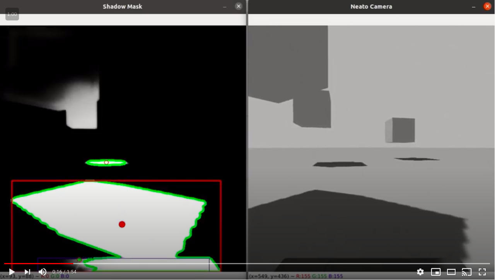
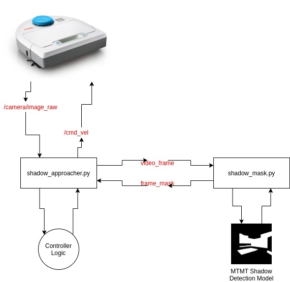
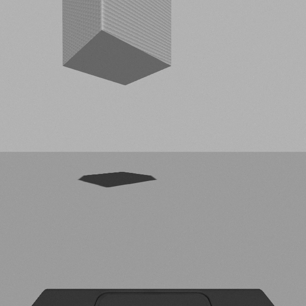
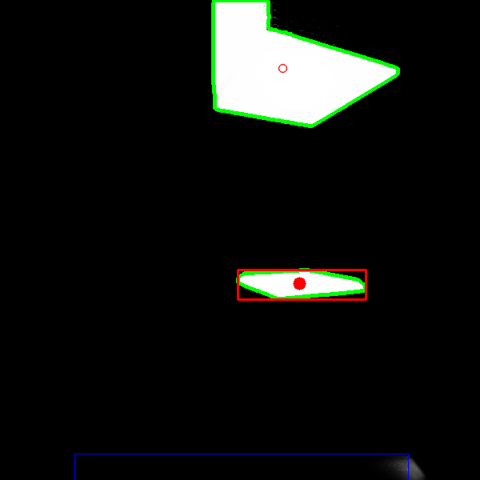

# Shadow Neato

Robot behavior to find and hide in closest available shadow.


Neato Camera View (click on image to view video):
[](https://youtu.be/U_qABB3b_0g)

## Requirements

* PyTorch
* NumPy
* OpenCV
* PIL
* [PyDenseCRF](https://github.com/lucasb-eyer/pydensecrf)
* [MTMT Shadow Detection Model](https://github.com/eraserNut/MTMT)

## Usage

```sh
# Start roscore
roscore

# Launch gazebo with camera
roslaunch neato_gazebo neato_gauntlet_world.launch load_camera:=true

# Start shadow neato behavior
roslaunch computer_vision shadow_neato.launch

# Optional: move with teleop
rosrun teleop_twist_keyboard teleop_twist_keyboard.py  
```

## Project Goal

The project's goal was to create a robotic behvior for the neato so that it can find and hide in nearby shadows using computer vision. The use case for this is that for robots that are performing search and rescue, they can detect shade and move injured patients into them and away from the sun. After building out this functionality, it is quite easy to now create the oppoiste behavior, avoiding shadows or chasing after sunlight. This could be useful for robots carrying plants for example.

Through this project I wanted to get a better understanding of OpenCV image processing, using a ML model in practice, and building a ROS project from scratch.

## Methodology

The core of the shadow behavior comes from the shadow detection and image processing done to select the shadow to move to. To accomplish this, I created two ROS nodes that communicate back and forth to each other. The first node is in `shadow_approacher.py` and handles interfacing with the Neato robot. This means retrieving the raw images from the camera and sending the motor information to the Neato, and other controller logic. The other node is in `shadow_mask.py` and handles performing inference on the raw camera images using the shadow detection model, creating the shadow masks and then publishing these masks onto a ros topic. This was done because performing inference using CPU takes a long time and doing all of this in one node would cause the rest of the operations to hang waiting on creating the shadow masks. Therefore two seperate nodes were created as ROS's pusblisher/subscriber model lends itself well to asynchronous operations. The following block diagram gives a general overview of the system:



The first step in choosing nearby shadows to hide into is detecting and isolating each shadow in view. To do this, a "shadow mask" is created where the source image is turned into a binary image where white areas are shadows and black areas are the rest of the image. This is done using the raw camera images received from the `video_frame` topic and running it through the MTMT Shadow Detection Model described [here](https://openaccess.thecvf.com/content_CVPR_2020/papers/Chen_A_Multi-Task_Mean_Teacher_for_Semi-Supervised_Shadow_Detection_CVPR_2020_paper.pdf). The model is multi task in that it simultaneously detects shadow regions, shadow edges, and shadow counts and uses semi-supervised mean teacher learning in training. 

With the mask created, back in `shadow_approacher.py` further image processing is done to remove noise that may have came about from areas that were mistaken to be shadows. To do this, I use morphological transformations and thresholding with OpenCV. Now with a clean binary image with the potential shadows isolated, I use OpenCV's contour approximation to extract the coordinates of the perimeter surrounding each shadow. These contours can be seen below outlined in green. With each contour, its center of mass is also calculated and visualized with a red circle.

Out of all the potential shadows, an optimal shadow must be chosen to move toward. To do this, a score is given to each shadow, calculated by taking the weighted sum of how close it is to the neato and how large of an area the shadow covers. This is done so that the most optimal shadow is chosen (can't be too small, be as close as possible). The shadow with the highest score is declared the optimal shadow and visualized with its circle at the center of mass filled in and a red bounding box enclosing it.




With the shadow to move into chosen, the neato rotates using proportional control until the shadow's center of mass is centered horizontally. The neato then moves forward until the front of the neato is within the shaded area. This is determined using the blue bounding box that is seen in mask above. If the blue box intersects the optimal shadow, the neato knows that it has now entered the shadow region and a final "push" is given so that it moves fully inside. 

### Extra Considerations

Outside of the default behavior, two additional states were given. These are called "Seeking" and "Hunting" in the code. The seeking state is engaged when the neato is currently within a shadow and is looking to move into a new shadow. This is given special functionality because in this state, the robot has to ignore the shadow area that it is currently in, and consider all shadows outside of this area. The hunting state is engaged when there are currently no visable shadows that can be seen with the camera. Here, the neato begins moving and turning, exploring, until it finds a viable shadow to move toward.

### Design Decisions

A couple specific design decisions were made when implementing this behavior. The first was that only shadows below the horizon line were considered when choosing the optimal shadow. This was done because often the model would pick up shaded regions that were floating and the neato could never enter that area. Therefore, only shadows on the ground were considered. Another design decision that was made was to limit the speed of any neato movement

Describe a design decision
* only get shadows below the horizon, slow movement to let inference catch up

## Reflection

What challenges did you face along the way
* Inference w/ cpu, model not working right, opencv ros bug

What would you do to improve the project if you had more time
* Move project to a machine that can use gpu acceleartion
* memory so that chose one shadow and go to it while not getting distracted by other closer shadows that pop up

Did you learn any interesting lessons for future robotics programmin projects?
